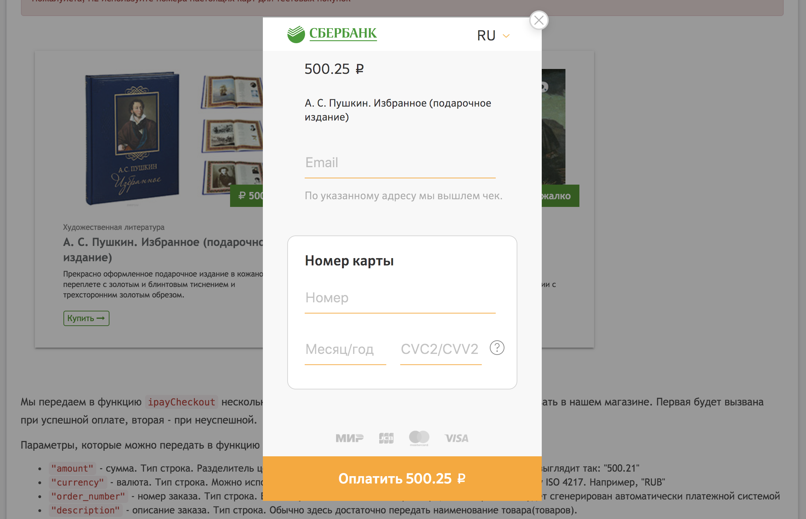

# react-sberbank-ipay

> Sberbank iPay UI by React

[](https://www.npmjs.com/package/react-sberbank-ipay) [](https://standardjs.com)

## Information



Official original documentation for Sberbank Pay Button:
https://3dsec.sberbank.ru/demopayment/docsite/pay-button.html


## Install

```bash
npm install --save react-sberbank-ipay
```

## Usage

```tsx
import * as React from 'react'

import SberbankIPay from 'react-sberbank-ipay';

class Example extends React.Component {
  render () {
    return (
      <>
        <ButtonOutline onClick={() => SberbankIPay.ipayCheckout({
          amount: 500,
          currency: 'RUB',
          order_number: '',
          description: 'My cool product'
        },
          function (order) { showSuccessfulPurchase(order) },
          function (order) { showFailurefulPurchase(order) })
        }>
          Do payment!
        </ButtonOutline>

        <SberbankIPay.Preloader
          apiToken="<your_token>"
          language="ru"
          classNamePreloader="payment-preloader"
        />
      </>
    )
  }
}
```

See `example` directory for demonstration


## License

MIT © [lulldev](https://github.com/lulldev)
